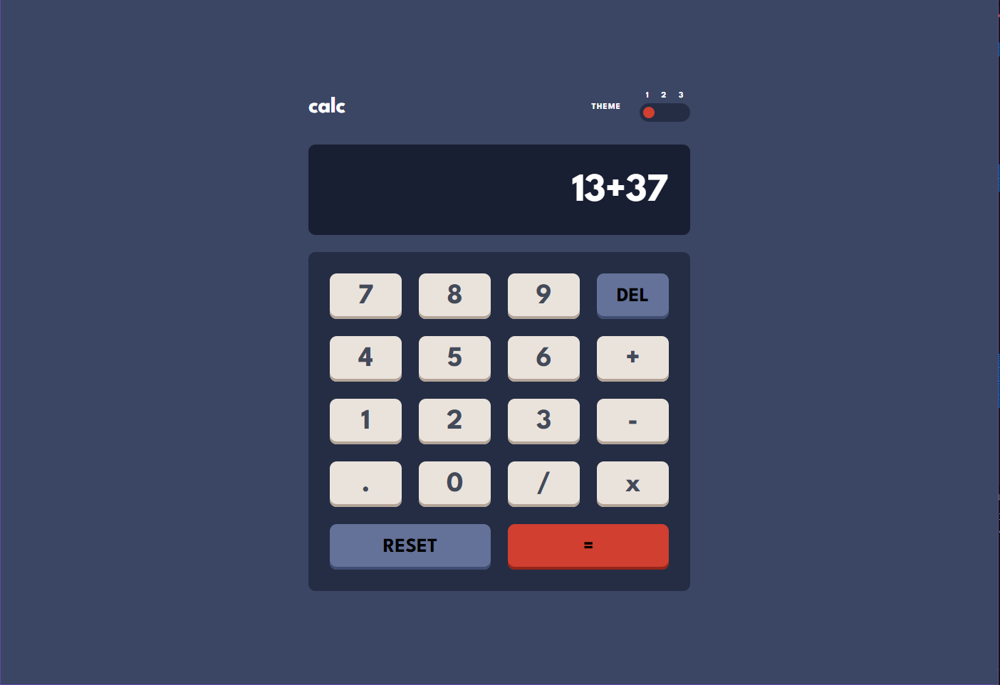
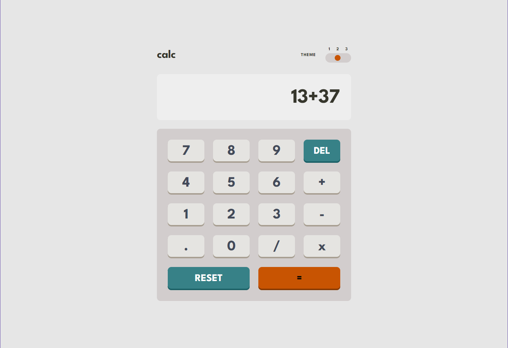
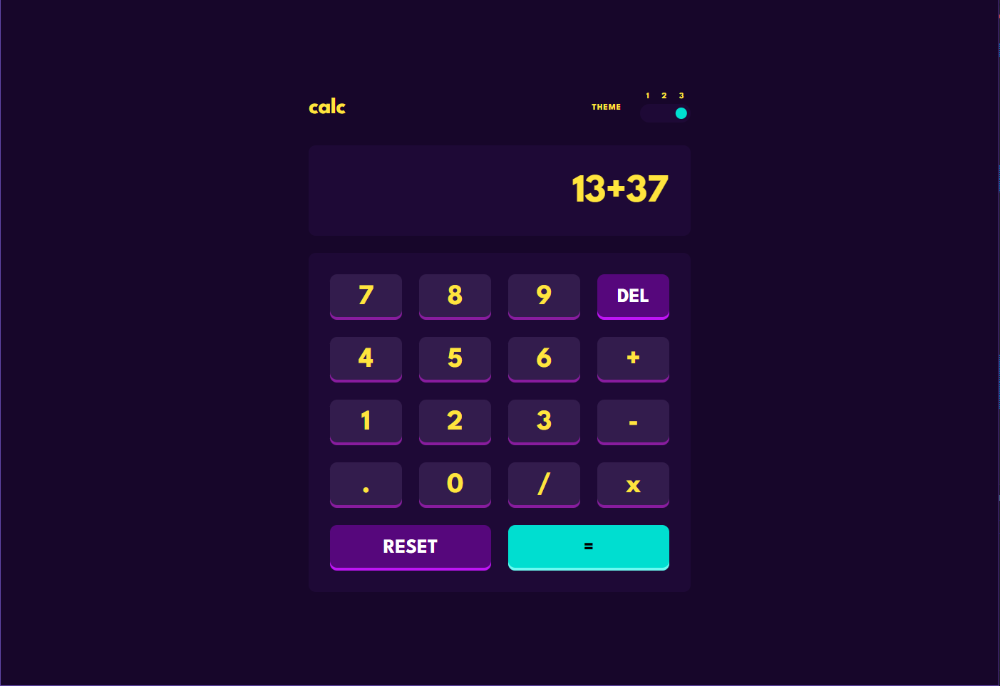

# Frontend Mentor - Calculator app solution

This is a solution to the [Calculator app challenge on Frontend Mentor](https://www.frontendmentor.io/challenges/calculator-app-9lteq5N29). Frontend Mentor challenges help you improve your coding skills by building realistic projects.

## Table of contents

- [Overview](#overview)
  - [Features](#features)
  - [Screenshot](#screenshot)
  - [Links](#links)
- [My process](#my-process)
  - [Built with](#built-with)
  - [What I learned](#what-i-learned)
  - [Continued development](#continued-development)
- [Author](#author)

## Overview

### Features

Users should be able to:

- See the size of the elements adjust based on their device's screen size
- Perform mathmatical operations like addition, subtraction, multiplication, and division
- Adjust the color theme based on their preference
- **TODO** Fix some issues like having multiple dots or too long calculation string.

### Screenshot

### Links

- Solution URL: [https://www.frontendmentor.io/solutions/react-sass-calculator-app-tried-to-build-it-with-typescript-EPaZQ3z1y5]
- Live Site URL: [https://bbualdo-calculator-app.netlify.app]

## My process

This was a simple project to style, so I decided to give **Sass** a try. First of all I set up project with Vite and React, and predefined color variables to reuse them later. Then I split it to two components: Calculator and Buttons, just to make it clean. After that I started to building JSX elements. Styling with Sass was convinient, because of possibility to nest classes, so implementing theme switching feature was piece of cake. So I did it and implemented logic for switching themes. At the end I added logic for calculation. App just takes each value on click and concatinates it to a single string. After clicking Equal Button it just evals this string.

### Built with

- Semantic HTML5 markup
- Sass
- Flexbox
- CSS Grid
- React

### What I learned

Work with number in JavaScript is the hardest one for me, so it was good practice. I tried to use my TypeScript Course knowledge, but I don't see advantages of this language at this moment. I know it is less error prone than JS, but that was probably too simple application to use it.
**EDIT** I had to rename tsx files into jsx because I couldn't deploy it. I tried to compile ts files into js and root js files into html file, but nothing worked.

### Continued development

I want to continue learning TypeScript at this moment, and then use React + TypeScript power to build some advanced applications.

## Author

- Website - [BBualdo](https://bbualdo-portfolio.netlify.app)
- Frontend Mentor - [@bbualdo](https://www.frontendmentor.io/profile/bbualdo)
